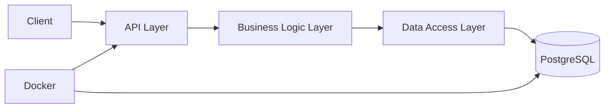
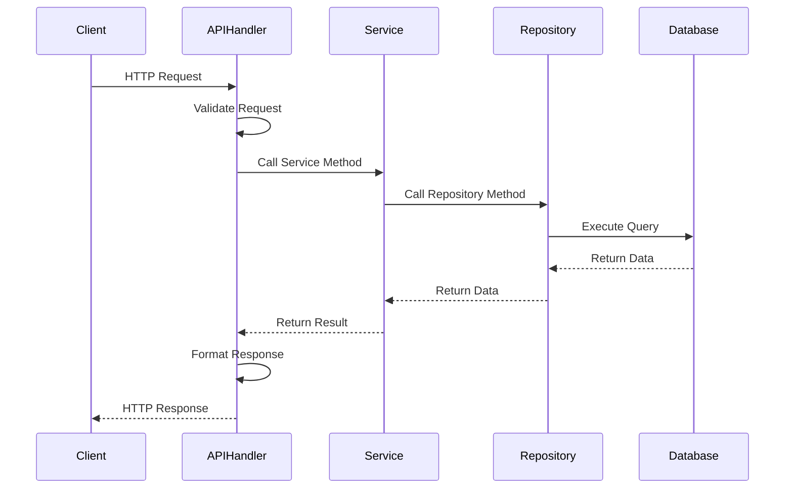
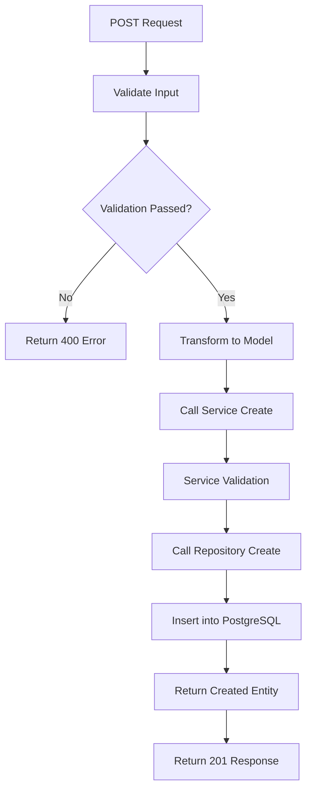
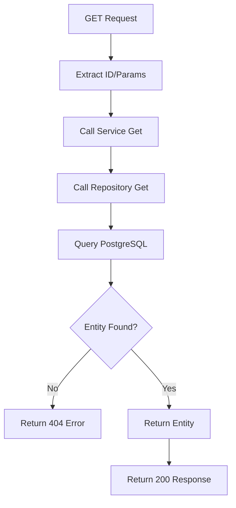
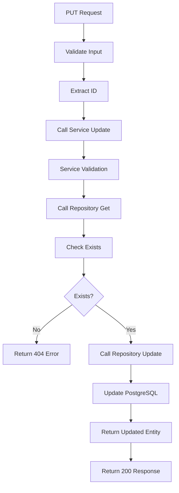
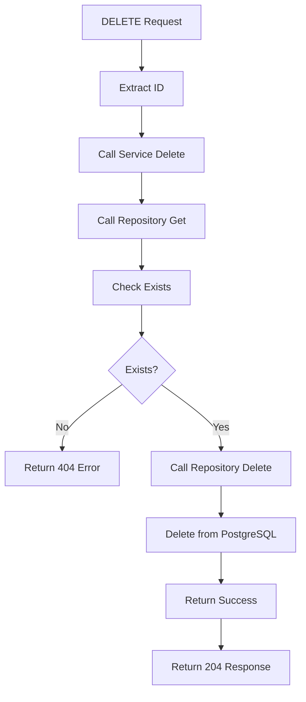
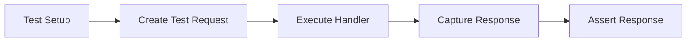
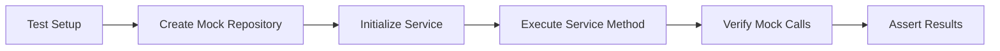
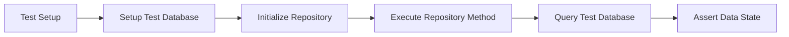
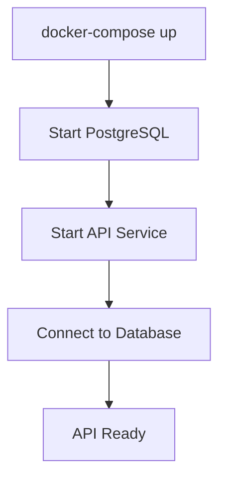

# REST API with Go, PostgreSQL, Unit Testing and Docker

## 1. Overview

This document outlines the design for a REST API application built with Go that interacts with a PostgreSQL database. The application will implement CRUD operations with proper unit testing and containerization using Docker.

### 1.1 Purpose
To create a scalable and maintainable RESTful API service that provides CRUD operations for data entities stored in a PostgreSQL database, with comprehensive unit tests and Docker deployment support.

### 1.2 Features
- RESTful API endpoints for CRUD operations
- PostgreSQL database integration
- Comprehensive unit testing
- Docker containerization
- Clean architecture with separation of concerns

## 2. Architecture

### 2.1 High-Level Architecture

The system follows a layered architecture pattern with clear separation of concerns:

This architecture ensures that each layer has a specific responsibility and can be developed, tested, and maintained independently.

### 2.2 Component Description
- **API Layer**: HTTP handlers that process incoming requests and return responses
- **Business Logic Layer**: Services that implement business rules and logic
- **Data Access Layer**: Repository pattern implementation for database operations
- **Database**: PostgreSQL for data persistence
- **Docker**: Containerization for consistent deployment

## 3. API Endpoints Reference

### 3.1 Generic Entity Endpoints
| Method | Endpoint       | Description          |
|--------|----------------|----------------------|
| GET    | /api/v1/{entity}      | Get all entities     |
| GET    | /api/v1/{entity}/{id} | Get entity by ID     |
| POST   | /api/v1/{entity}      | Create new entity    |
| PUT    | /api/v1/{entity}/{id} | Update entity by ID  |
| DELETE | /api/v1/{entity}/{id} | Delete entity by ID  |

### 3.2 Request/Response Schema

#### GET /api/v1/{entity}
**Response Structure:**
- data: Array of entity objects
- count: Number of entities returned

#### GET /api/v1/{entity}/{id}
**Response Structure:**
- data: Single entity object

#### POST /api/v1/{entity}
**Request Structure:**
- Entity fields required for creation

**Response Structure:**
- data: Created entity object with assigned ID

#### PUT /api/v1/{entity}/{id}
**Request Structure:**
- Entity fields to be updated

**Response Structure:**
- data: Updated entity object

#### DELETE /api/v1/{entity}/{id}
**Response Structure:**
- message: Confirmation of deletion

## 4. Data Models & Database Schema

### 4.1 Generic Entity Model
The entity model includes:
- ID: Unique identifier
- Name: Entity name
- CreatedAt: Timestamp of creation
- UpdatedAt: Timestamp of last update

### 4.2 PostgreSQL Schema
Entities table with:
- id: SERIAL PRIMARY KEY
- name: VARCHAR(255) NOT NULL
- created_at: TIMESTAMP with default CURRENT_TIMESTAMP
- updated_at: TIMESTAMP with default CURRENT_TIMESTAMP

## 5. Project Structure

The project follows a structured layout that separates concerns:

- cmd/: Entry points for the application
- internal/: Core business logic separated into:
  - handlers/: HTTP request handlers
  - services/: Business logic implementations
  - models/: Data structures
  - repository/: Data access layer
  - database/: Database connection utilities
- pkg/: Shared utilities
- tests/: All test files organized by component
- Dockerfile: Container configuration
- docker-compose.yml: Multi-container setup
- go.mod/go.sum: Go module dependencies

## 6. Business Logic Layer

### 6.1 Service Interface
Services define the business logic operations:
- GetAllEntities()
- GetEntityByID(id)
- CreateEntity(entity)
- UpdateEntity(id, entity)
- DeleteEntity(id)

### 6.2 Repository Interface
Repositories handle data access operations:
- GetAll()
- GetByID(id)
- Create(entity)
- Update(id, entity)
- Delete(id)

## 7. Database Integration

### 7.1 Connection Management
- Use pgx or sqlx for PostgreSQL connectivity
- Implement connection pooling for performance
- Handle connection lifecycle properly

### 7.2 Migration Strategy
- Use Goose or migrate for database schema migrations
- Version-controlled migration files
- Automated migration on application startup

## 8. Unit Testing

### 8.1 Test Structure

The test structure mirrors the application structure for consistency:

- handlers/: Tests for HTTP layer
- services/: Tests for business logic
- repository/: Tests for data access
- mocks/: Mock implementations for testing

### 8.2 Testing Strategy
- **Handler Tests**: Test HTTP request/response handling
- **Service Tests**: Test business logic with mocked repositories
- **Repository Tests**: Test database operations with test database
- **Mocking**: Use testify/mock for dependency mocking

### 8.3 Test Examples

#### Repository Test Approach
- Setup test database
- Initialize repository with test database
- Execute repository method
- Assert results and errors

#### Service Test Approach
- Create mock repository
- Initialize service with mock repository
- Set mock expectations
- Execute service method
- Assert results and verify mock interactions

## 9. Docker Configuration

### 9.1 Dockerfile Structure
- Multi-stage build process
- Go build in first stage
- Alpine base in final stage
- Copy binary from build stage
- Expose application port
- Define entrypoint

### 9.2 Docker Compose Services
- API service built from Dockerfile
- PostgreSQL database service
- Volume mounting for data persistence
- Environment variable configuration
- Service dependencies

## 10. Error Handling

### 10.1 Error Types
- Database errors
- Validation errors
- Not found errors
- Internal server errors

### 10.2 Error Response Structure
- error object containing:
  - code: Error identifier
  - message: Human-readable error message
  - details: Additional error information

## 11. Action Flows

### 11.1 System Components Interaction Flow

### 11.2 CRUD Operation Flows

#### Create Entity Flow

The create entity flow handles the process of creating a new entity in the system:

1. **API Layer Processing**
   - Receive POST request at `/api/v1/entities`
   - Parse JSON body from request
   - Validate required fields are present
   - Check data types and formats
   - Transform raw data into entity model

2. **Service Layer Processing**
   - Receive entity model from handler
   - Apply business logic validation
   - Check for duplicates if needed
   - Set creation timestamps
   - Call repository create method

3. **Repository Layer Processing**
   - Receive validated entity model
   - Generate SQL INSERT statement
   - Execute query with parameterized values
   - Retrieve generated ID from database
   - Return created entity with ID

4. **Response Handling**
   - Service receives created entity
   - API layer formats response
   - Return 201 Created status
   - Include created entity in response body

#### Read Entity Flow

The read entity flow handles retrieving entities from the system:

1. **Single Entity Retrieval**
   - API layer receives GET request at `/api/v1/entities/{id}`
   - Extract entity ID from URL parameters
   - Validate ID format and type
   - Call service get by ID method
   - Service calls repository get by ID
   - Repository executes SELECT query
   - If found, return entity; if not, return 404

2. **Multiple Entities Retrieval**
   - API layer receives GET request at `/api/v1/entities`
   - Parse query parameters (pagination, filters)
   - Call service get all method
   - Service calls repository get all
   - Repository executes SELECT query with conditions
   - Return list of entities with count

3. **Response Handling**
   - Format entity/entities in response body
   - Set appropriate HTTP status code
   - Include metadata for pagination if applicable

#### Update Entity Flow

The update entity flow handles modifying existing entities:

1. **API Layer Processing**
   - Receive PUT request at `/api/v1/entities/{id}`
   - Extract entity ID from URL
   - Parse JSON body with update data
   - Validate update data format
   - Transform to entity model

2. **Service Layer Processing**
   - Receive entity ID and update model
   - Validate business rules for update
   - Check if entity exists (call repository)
   - Merge update data with existing entity
   - Set update timestamp
   - Call repository update method

3. **Repository Layer Processing**
   - Receive entity ID and update model
   - Generate SQL UPDATE statement
   - Execute query with parameterized values
   - Verify update affected rows
   - Retrieve updated entity data
   - Return updated entity

4. **Response Handling**
   - Return updated entity in response
   - Set 200 OK status code
   - Handle concurrency issues if applicable

#### Delete Entity Flow

The delete entity flow handles removing entities from the system:

1. **API Layer Processing**
   - Receive DELETE request at `/api/v1/entities/{id}`
   - Extract entity ID from URL
   - Validate ID format
   - Call service delete method

2. **Service Layer Processing**
   - Receive entity ID to delete
   - Check if entity exists (call repository)
   - Apply business rules (dependencies, permissions)
   - Handle cascading deletes if needed
   - Call repository delete method

3. **Repository Layer Processing**
   - Receive entity ID to delete
   - Generate SQL DELETE statement
   - Execute query with parameterized ID
   - Verify deletion affected rows
   - Handle foreign key constraints
   - Return success confirmation

4. **Response Handling**
   - Return 204 No Content status
   - Empty response body
   - Handle errors and constraints

### 11.3 Data Flow Through Layers

#### Request Data Flow
1. **API Layer**: Receives raw HTTP request
   - Parses URL parameters
   - Deserializes request body
   - Validates input format

2. **Service Layer**: Processes business logic
   - Validates business rules
   - Transforms data as needed
   - Coordinates multiple operations

3. **Repository Layer**: Handles data persistence
   - Maps domain models to database schema
   - Executes SQL queries
   - Handles database connections

4. **Database Layer**: PostgreSQL operations
   - Performs CRUD operations
   - Enforces constraints
   - Maintains data integrity

#### Response Data Flow
1. **Database Layer**: Returns query results
2. **Repository Layer**: Maps results to domain models
3. **Service Layer**: Applies business logic to results
4. **API Layer**: Formats response and sends HTTP response

### 11.4 Unit Testing Flows

The testing strategy follows a pyramid approach with unit tests forming the base, focusing on isolated component testing with appropriate mocking.

#### Handler Testing Flow

Handler tests focus on HTTP request/response handling and validation logic:

1. **Test Setup**
   - Create test HTTP request with specific method and URL
   - Prepare request body and headers as needed
   - Initialize handler with mocked dependencies
   - Set up test HTTP recorder for capturing responses

2. **Request Execution**
   - Execute handler function with test request
   - Capture HTTP response from recorder
   - Extract response body and status code

3. **Response Validation**
   - Assert correct HTTP status code
   - Validate response body structure and content
   - Check headers and other response metadata
   - Verify error responses when expected

#### Service Testing Flow

Service tests validate business logic with mocked repositories:

1. **Test Setup**
   - Create mock repository implementations
   - Initialize service with mocked dependencies
   - Prepare test data and expected values
   - Set up mock expectations for method calls

2. **Test Execution**
   - Call service method with test parameters
   - Capture returned values and errors
   - Verify mock method call counts and parameters

3. **Result Validation**
   - Assert correct business logic execution
   - Validate returned data transformations
   - Check error handling for edge cases
   - Verify mock interactions match expectations

#### Repository Testing Flow

Repository tests verify database operations against a test database:

1. **Test Environment Setup**
   - Initialize connection to test database
   - Create clean database state (truncate/seed)
   - Initialize repository with test database
   - Prepare test entities and data

2. **Operation Testing**
   - Execute repository method (Create, Read, Update, Delete)
   - Capture returned entities or status
   - Handle database transaction boundaries

3. **State Verification**
   - Query database directly to verify changes
   - Assert entity properties match expectations
   - Check data integrity constraints
   - Validate error conditions (not found, duplicates)

#### Test Organization

- **Handler Tests**: Focus on HTTP layer, request validation, and response formatting
- **Service Tests**: Validate business rules, data transformations, and logic flows
- **Repository Tests**: Verify database operations, query correctness, and data integrity
- **Integration Tests**: End-to-end testing of complete workflows through all layers

### 11.5 Docker Deployment Flow

#### Build Process
1. Docker build triggers multi-stage build
2. Go modules downloaded in build stage
3. Application compiled in build stage
4. Binary copied to runtime stage
5. Runtime container created

#### Runtime Process
1. Container starts
2. Database migrations executed
3. Application server initialized
4. API endpoints become available
5. Health checks begin

#### Docker Compose Flow

## 12. Security Considerations

- Input validation and sanitization
- SQL injection prevention through parameterized queries
- Rate limiting
- CORS configuration
- HTTPS in production
- Environment-based configuration

## 13. API Documentation

- Use Swagger/OpenAPI for API documentation
- Auto-generated documentation from code
- Interactive API testing interface